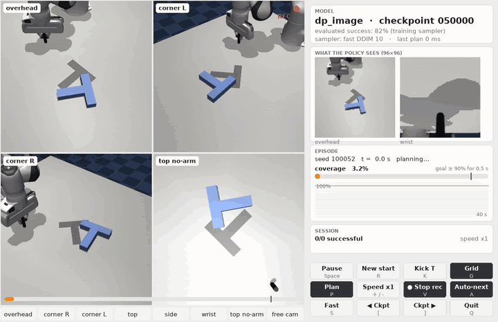
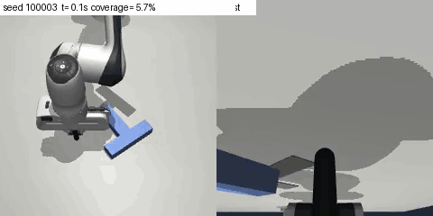
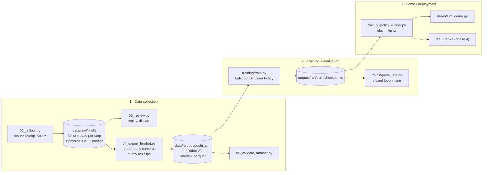
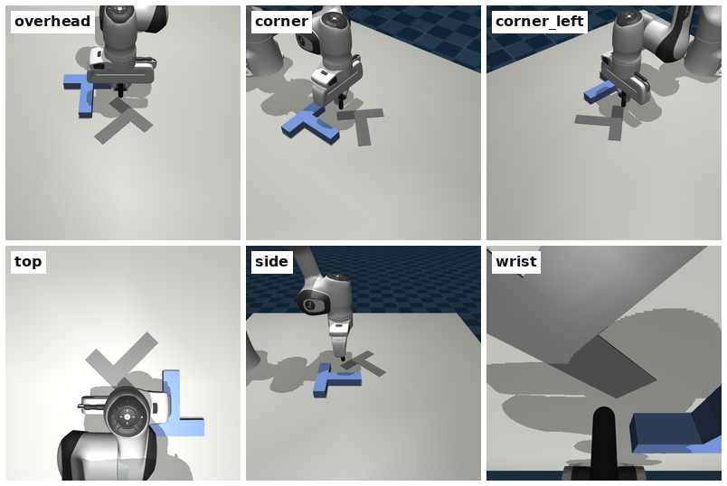
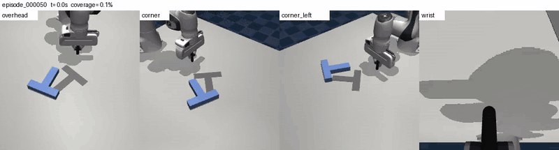
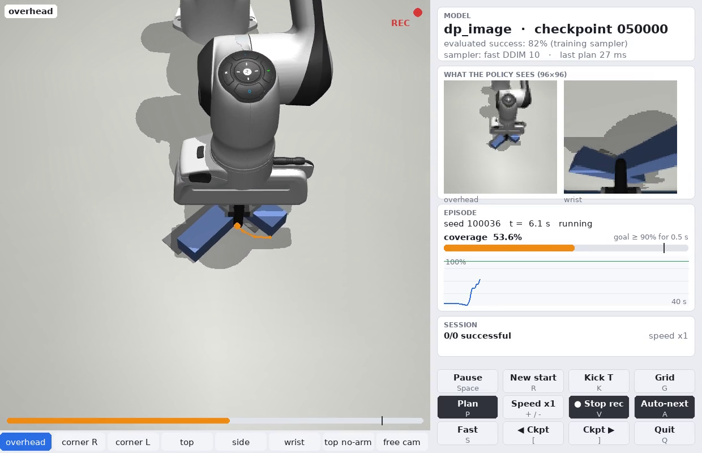

# Push-T with a Franka Panda: imitation learning with Diffusion Policy

A Franka Panda holding a rigid **stick** (no gripper) pushes a **T-shaped block** onto a fixed
**T-shaped target**, matching both position and orientation. This is the classic
[Push-T](https://diffusion-policy.cs.columbia.edu/) task, moved from a 2D toy environment to a
full 7-DoF arm in MuJoCo and set up so it can carry over to the real robot.

The project covers the full loop: mouse teleoperation → raw demos → **LeRobot** dataset →
**Diffusion Policy** training → closed-loop evaluation → an interactive simulation demo.
The next step is the real Franka.

<p align="center">
  
  <br>
  <em>The trained image policy running live in the demo app (1.5× speed). The orange line is the
  policy's planned stick path. On the right: the 96×96 images the policy actually sees, the
  target coverage, and the session stats.</em>
</p>

## Highlights

- **Record state, render later.** Demos store the full MuJoCo state at every 50 Hz step, not
  images. Cameras, resolution and fps are chosen at export time, so camera placement can change
  without collecting the demos again.
- **Robot-agnostic action space.** The action is the stick-tip position `[x, y]` on the table,
  the same as the original Push-T. A planar IK controller locks height and orientation, so the
  same policy output can drive the real Franka through a Cartesian controller.
- **Deployable observations only.** The image policy sees two cameras (`overhead` + `wrist`)
  plus the tip position. It never gets the block pose, because the real robot has no sensor
  for it.
- **Exact reproducibility.** Every episode stores its own physics XML and configs. Replaying
  the recorded setpoints reproduces the trajectory with zero error (checked by `smoke_test.py`).
- **Fits a 6 GB laptop GPU.** An 89M-parameter U-Net trains in about 6 h on an RTX 4050.
  Evaluation runs 50 episodes in parallel with batched GPU planning.

## Results

Image policy (`overhead` + `wrist` + tip position), trained on **86 human demos** (17 min of
data). Success means the block covers ≥ 90 % of the target for 0.5 s (about 5 mm / 5° on a
16 cm T). Each checkpoint is evaluated on the same 50 random starts in simulation, with a 40 s
limit.

| Checkpoint | 10k | 20k | 30k | 40k | 50k | 60k | 70k | 80k | 90k | 100k |
|---|---|---|---|---|---|---|---|---|---|---|
| Success (50 episodes) | 2 % | 52 % | 70 % | 76 % | **82 %** | 76 % | 76 % | **84 %** | 76 % | 78 % |

- Performance plateaus at **76–84 % from 40k steps** onwards.
- A 100-episode re-evaluation of the 80k checkpoint gives **74 %** (95 % CI 65–82) with the
  training sampler (DDPM, 100 steps) and **78 %** (69–85) with a 10-step DDIM sampler. DDIM
  plans about **8× faster** (under 30 ms per plan in the demo app), so the demo uses it by default.
- Diffusion sampling is stochastic: running the same start twice gives a different outcome
  22 % of the time.
- Most failures stall at 50–80 % coverage rather than pushing the block away. Evaluation
  starts are about as far from the demos as the demos are from each other (median 3.0 vs
  3.2 cm), and success does not drop with that distance, so the policy is not just replaying
  the closest demo (`training/analyze_eval.py`).

<p align="center">
  
  <br>
  <em>An evaluation rollout, shown from the two policy cameras (overhead | wrist).</em>
</p>

## Architecture



### Simulation (`pusht/`)

| Module | Role |
|---|---|
| `scene.py` | Builds the MuJoCo model from `assets/franka_emika_panda/pusht_scene.xml` and `configs/scene.yaml`: table, T block (free body), fixed grey target, cameras, lighting |
| `controller.py` | `PlanarController`: turns a desired tip `[x, y]` into joint targets. Damped least-squares IK on the tip site, with a nullspace pull towards the home posture. Commands are clamped to the workspace and rate-limited to 0.25 m/s |
| `env.py` | `PushTEnv`: seeded random starts, `step()` = one 50 Hz control period, coverage metric, success rule |
| `geometry.py` | T-shape polygon (shapely); coverage = overlap area / target area |
| `recorder.py` | Crash-safe HDF5 writer, one file per episode |
| `render.py` | Offscreen EGL rendering on the NVIDIA GPU (~0.8 ms per frame), threaded renderer, pixel ↔ table-plane mapping |
| `teleop.py` | Top-down pygame teleop window with the arm hidden, HUD and coverage bar |

The Panda uses position actuators with gravity compensation. The servo damping time constant
is lowered from Menagerie's 0.1 s to 0.03 s, which cuts tip lag at full speed from ~24 mm to
~8 mm. The tip height stays within about 1 mm of its setpoint and the stick within 0.3° of
vertical.

### Data format

**Raw episode** (`data/raw/episode_XXXXXX.hdf5`), one row per 50 Hz control step:

| Field | Content |
|---|---|
| `state` | full MuJoCo integration state (exact replay, re-render and re-simulation) |
| `tip_xy`, `block_pose`, `coverage` | measured tip, block `(x, y, yaw)`, target coverage |
| `setpoint_xy` | raw operator input (mouse position on the table) |
| `action_xy` | commanded tip after clamp and rate limit: **the policy action** |
| `q_des`, `qpos`, `qvel`, `time`, `mouse_down` | joint targets, joint state, timing, operator activity |
| metadata | seeds, success and discard flags, physics XML and all configs verbatim |

**LeRobot dataset** (exported at 10 Hz):

| Feature | Shape | Meaning |
|---|---|---|
| `observation.images.<cam>` | 96×96×3 video | rendered from the stored state |
| `observation.state` | 2 | measured tip `[x, y]` (m, table frame) |
| `observation.environment_state` | 4 | block `[x, y, cos yaw, sin yaw]` (low-dim baseline only) |
| `action` | 2 | commanded tip `[x, y]` at the end of the frame |

<p align="center">
  
  <br>
  <em>Cameras defined in <code>configs/cameras.yaml</code>. The policy uses <code>overhead</code> + <code>wrist</code>:
  <code>07_camera_study.py</code> showed that this pair never loses the block at the same time,
  while a single fixed camera is often blocked by the arm.</em>
</p>

### Policy (`training/`)

LeRobot's Diffusion Policy with the paper's Push-T image settings, sized down for a 6 GB GPU:

| Setting | Value |
|---|---|
| Observations | last 2 steps of `overhead` + `wrist` images (96×96, random 84×84 crop) and tip `[x, y]` |
| Vision encoder | one ResNet18 per camera, trained from scratch, GroupNorm, spatial softmax (32 keypoints) |
| Action head | 1D conditional U-Net with FiLM, `down_dims [256, 512, 1024]` (89M parameters; the paper's 278M does not fit in 6 GB) |
| Diffusion | DDPM, 100 train steps, squared-cosine schedule, ε-prediction; DDIM with 10 steps at inference |
| Action chunking | predict 16 actions (1.6 s), execute 8 (0.8 s), then re-plan |
| Training | 100k steps, batch 64, AdamW 1e-4, cosine schedule, mixed precision |

`dp_lowdim.yaml` is a sanity-check baseline that gets the exact block pose instead of images.
It can't be deployed without block tracking, but it shows the best result this data can give.

`policy_runner.py` is the only piece between a checkpoint and a robot:

```python
runner = PolicyRunner("outputs/dp_image", "080000", inference_steps=10)  # DDIM-10
runner.reset()
xy = runner.act({
    "observation.images.overhead": rgb_uint8_96x96x3,
    "observation.images.wrist":    rgb_uint8_96x96x3,
    "observation.state":           np.array([tip_x, tip_y]),
})  # -> commanded tip [x, y] in metres; call at 10 Hz
```

## Demonstrations

<p align="center">
  
  <br>
  <em>A human demo (mouse teleop), re-rendered afterwards from four cameras with <code>06_render_videos.py</code>.</em>
</p>

## Installation

Tested on Ubuntu with Python 3.12 and an NVIDIA RTX 4050 (6 GB). No Docker or sudo needed.

```bash
curl -LsSf https://astral.sh/uv/install.sh | sh           # installs uv to ~/.local/bin
uv venv .venv --python 3.12
uv pip install --python .venv/bin/python -r requirements.lock
.venv/bin/python scripts/00_check_env.py                  # every line should say [ok]
.venv/bin/python scripts/smoke_test.py                    # should end with 23/23 checks passed
```

Main dependencies: MuJoCo 3.14, LeRobot 0.6.1, PyTorch 2.11 + CUDA, pygame, h5py, shapely.
Optional: system `ffmpeg` enables LeRobot's faster `torchcodec` video decoder; otherwise PyAV
is used.

Run every script from the project root with `.venv/bin/python`.

## Quick start: run the pretrained model

No data or training needed. The trained policy is hosted on the
[Hugging Face Hub](https://huggingface.co/HSM1/pusht-franka-diffusion-policy)
(~350 MB), and the demo downloads it on its first start:

```bash
.venv/bin/python demo/sim_demo.py                          # downloads the model, then runs it live
.venv/bin/python training/evaluate.py outputs/dp_image     # success rate on 50 random starts
```

To only download it: `.venv/bin/python scripts/09_download_model.py`. The model comes with a
`pusht_meta.json` that stores the fps, cameras, image size and physics of its training data,
so the simulator reproduces the training conditions exactly without the dataset.

## Usage

### 1. Collect demos

```bash
.venv/bin/python scripts/02_collect.py --operator <name>
.venv/bin/python scripts/03_review.py --summary          # counts; without --summary: replay, D = discard
```

Hold the left mouse button to drag the stick tip (red dot). Recording starts at the first click,
and an episode saves automatically on success. `R` discards the attempt, `X` un-saves the last
episode, `P` pauses, `Q` quits.

Tips for good demos: move smoothly, use one consistent strategy (rotate first, then translate
and fine-align), slow down near the goal, and press `R` after a bad fumble. The policy copies
your mistakes. Aim for about 200 successful demos (`lerobot/pusht` has 206).

> Set the real T dimensions and target placement in `configs/scene.yaml` **before** collecting.
> Changing the geometry later means collecting again. Cameras can change at any time.

### 2. Export and validate the dataset

```bash
.venv/bin/python scripts/04_export_lerobot.py --cameras overhead wrist --out data/lerobot/pusht_sim --overwrite
.venv/bin/python scripts/04_export_lerobot.py --no-images --out data/lerobot/pusht_sim_lowdim --overwrite
.venv/bin/python scripts/05_validate_dataset.py --root data/lerobot/pusht_sim
```

Exporter options: `--cameras`, `--res H W`, `--fps` (must divide 50), `--light-randomize`,
`--include-failed`, `--min-final-coverage`. The validator checks shapes, fps and normalization
stats, decoded frames (`validation_frames.png`), action/state alignment, and that replaying the
10 Hz actions open-loop in the simulator reproduces the recorded outcome.

### 3. Train and evaluate

```bash
.venv/bin/python training/train.py training/configs/dp_image.yaml            # ~6 h; Ctrl+C is safe
.venv/bin/python training/train.py training/configs/dp_image.yaml --resume
.venv/bin/python training/evaluate.py outputs/dp_image                       # newest checkpoint
.venv/bin/python training/evaluate.py outputs/dp_image --all                 # every checkpoint, 3 in parallel
```

Each run writes to `outputs/<run_name>/`: `run_config.yaml`, `train_log.txt`,
`train/checkpoints/<step>/`, and `eval/<checkpoint>/` (`results.json`, `episodes.csv`, videos).

### 4. Publish a model

```bash
.venv/bin/hf auth login                                                       # once
.venv/bin/python scripts/08_package_model.py --upload <hf-user>/pusht-franka-diffusion-policy
```

This packages the best evaluated checkpoint into `release/dp_image/` (weights, configs,
`pusht_meta.json`, eval results, model card, without the 680 MB optimizer state) and uploads it.
Then set `PRETRAINED_REPO` in `training/policy_runner.py` to the same repo id, so that clones
download it.

### 5. Run the simulation demo

```bash
.venv/bin/python demo/sim_demo.py                                # best evaluated checkpoint, DDIM-10
.venv/bin/python demo/sim_demo.py --checkpoint 080000 --seed 100035
.venv/bin/python demo/sim_demo.py --run outputs/dp_lowdim --ddpm
```

<p align="center">
  
</p>

| Input | Action |
|---|---|
| Drag the T / mouse wheel over the T | move / rotate the block to test how the policy reacts |
| `1`–`8`, `G` | camera tabs (including a free orbit camera), 2×2 grid |
| `Space`, `R`, `K` | pause, new random start, kick the T |
| `S`, `[` `]` | switch sampler (DDIM-10 / DDPM), previous / next checkpoint |
| `P`, `+` `-`, `A` | plan overlay, simulation speed, auto-next episode |
| `V` | record the window to `outputs/<run>/demo_videos/*.mp4` |

The policy plans on a background thread, so the window stays at about 50 fps.

## Scripts

| Script | What it does |
|---|---|
| `scripts/00_check_env.py` | Checks MuJoCo GPU rendering, torch + CUDA, LeRobot, video I/O |
| `scripts/01_scene_preview.py` | Renders every camera to `data/preview/*.png` (camera tuning) |
| `scripts/02_collect.py` | Teleoperation session, one HDF5 per demo |
| `scripts/03_review.py` | Summary table, replay window, mark episodes discarded |
| `scripts/04_export_lerobot.py` | Raw demos → LeRobot dataset |
| `scripts/05_validate_dataset.py` | Loads the dataset and checks it |
| `scripts/06_render_videos.py` | Recorded demos → MP4 with several cameras side by side |
| `scripts/07_camera_study.py` | How often each camera or camera pair can see the T (arm occlusion) |
| `scripts/08_package_model.py` | Checkpoint → self-contained package, optional upload to the Hugging Face Hub |
| `scripts/09_download_model.py` | Downloads (or installs a local) packaged model into `outputs/dp_image/` |
| `scripts/smoke_test.py` | Full pipeline test without a human (23 checks) |
| `training/train.py` | Config → LeRobot training run (GPU, AMP, resume) |
| `training/evaluate.py` | Checkpoints → closed-loop success rate, CSV, videos |
| `training/analyze_eval.py` | How far eval starts are from the demos, success vs. that distance |
| `training/policy_runner.py` | Checkpoint + observation → action (sim and real robot) |
| `demo/sim_demo.py` | Interactive demo app (`demo/ui.py` is its small pygame UI toolkit) |

## Repository layout

```
configs/
  scene.yaml        T size, mass, friction; target pose; workspace; tip height; randomization
  cameras.yaml      camera definitions (edit any time, then re-export)
  collect.yaml      control rate, speed limit, success threshold, export defaults
pusht/              simulation package: scene, controller, env, recorder, renderer, teleop
scripts/            data pipeline (00–07), model packaging (08–09), smoke test
training/           train / evaluate / analyze, policy runner, configs/dp_image.yaml, dp_lowdim.yaml
demo/               interactive simulation demo
assets/             Panda + stick MuJoCo model
docs/media/         README images and GIFs
CHECKLIST.md        detailed task list
```

Not in git (see `.gitignore`): `data/` (raw demos and exported datasets), `outputs/`
(checkpoints are about 1 GB each) and `release/`. Everything in `data/` except `data/raw/` can be
regenerated from the raw demos. The trained model is published on the Hugging Face Hub instead
(see the quick start).

## Task definition

- **Action:** commanded stick-tip `[x, y]` in the table frame (metres), 10 Hz in the dataset.
- **Height and orientation are locked.** The tip stays 15 mm above the table and the stick
  points straight down. Commands are clamped to a 42 × 50 cm workspace and rate-limited to
  0.25 m/s.
- **Target** is fixed at `(0.50, 0.00)` with a 45° yaw, as in the original Push-T. The initial
  block pose and tip position are random, seeded and recorded.
- **Success:** ≥ 90 % coverage held for 0.5 s. The Diffusion Policy benchmark uses 95 % (about
  2.6 mm / 2.5°), which is very hard to reach by mouse. Coverage is stored at every step, so the
  exporter can re-select episodes with a stricter or looser threshold later.

## Roadmap

- [x] Phase 1: simulation, teleop and data pipeline (86 demos collected so far)
- [x] Phase 2: Diffusion Policy training and evaluation (76–84 % success)
- [x] Phase 3: interactive simulation demo
- [ ] More demos (~200), then retrain and re-evaluate
- [ ] Phase 4: real Franka with a stick tool, matched cameras, Cartesian impedance control on
      the same `[x, y]` action space, and real-world fine-tuning data in the same LeRobot format

See [CHECKLIST.md](CHECKLIST.md) for the detailed task list.

## Known quirks

- On Wayland the teleop window has no title bar (SDL's GTK decoration plugin is missing). It
  works normally otherwise.
- Fixed cameras sometimes lose the block behind the arm, as real cameras would. The `wrist`
  camera covers those moments.

## Acknowledgements

- [Diffusion Policy](https://diffusion-policy.cs.columbia.edu/) (Chi et al., RSS 2023): the
  Push-T task and the policy.
- [LeRobot](https://github.com/huggingface/lerobot): dataset format, Diffusion Policy
  implementation and training loop.
- [MuJoCo](https://mujoco.org/) and [MuJoCo Menagerie](https://github.com/google-deepmind/mujoco_menagerie):
  the Franka Panda model (Apache-2.0, see `assets/franka_emika_panda/LICENSE`).
- [ManiSkill](https://github.com/haosulab/ManiSkill): the stick tool geometry (Apache-2.0).

## License

The code is released under the [MIT License](LICENSE). The Franka Panda model in
`assets/franka_emika_panda/` comes from MuJoCo Menagerie and keeps its
[Apache-2.0 license](assets/franka_emika_panda/LICENSE).
